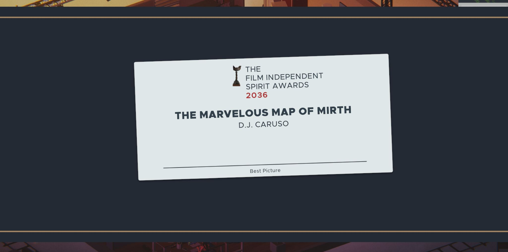
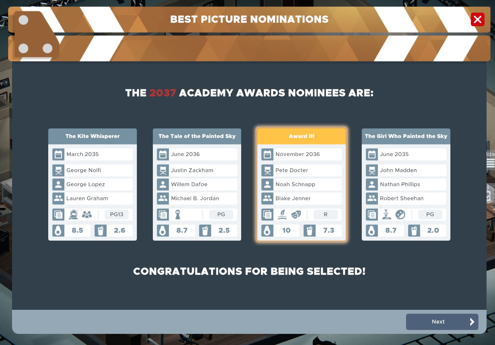

# Real Awards for The Executive: Movie Industry Tycoon game

### Description

Existing Awards are converted to the Academy Awards and Golden Globe. Added the Independent Spirit Awards, Cannes, Berlinale and Venice Film Festival. Dates of nominations/selections and ceremonies are adjusted to the real life events. It gives the players a more realistic and eventful expereience throughout the year. See more details about each Award below:

| Name      | Academy Awards | Golden Globe | Independent Spirit Awards | Cannes      | Berlinale  | Venice Film Festival  |
|-----------|----------------|--------------|---------------------------|-------------|------------|-----------------------|
| From      | 1971           | 1972         | 1984                      | 1973        | 1978       | 1971                  |
| Eligible Budget     | Medium, Large           | Large, Blockbuster        | Small                         | Medium           | Small          | Small, Medium, Large               |
| Min. Critic Score | 9.0              | 8.0            | 8.5                       | 9.0           | 8.5        | 8.0                     |
| Nomination Date | Mid Jan        | Early Jan    | Early Jan                 | Early Apr | Late Jan   | Late July             |
| Ceremony Date | Early Mar    | Late Jan     | Before Oscar              | Mid May     | Early Febr | Early Sept            |

### Install

Unzip the package and just copy the `RealAwards-1.0` folder to your `...\SteamLibrary\steamapps\common\The Executive\Mods` folder.

### Custom balance

If you prefer to further customize or balance the current features, just modify the `RealAwards-1.0/Industry/Awards.json` file. Adding a new Award is also straightforward by following the pattern in the `.json` file, images are in the `Ui` folder and make sure the `Localization.csv` is updated as well.

- Date format logic: 
    
    `"nomination-date": "0/0/0/2"` --> very early days of January (around third of the first week)
    
        Value: `year from release` / `month index (0: jan, 1: febr etc.)` / `week index (0-3)` / `% of a week (1 = ~15%)`

    `"ceremony-delay": "0/8/1/3"` --> can be used also as a date format, but it is NOT an actual date, it is how long after the Nomination date, so always use as an addition

For additional balance and difficulty, you can experiment with the `nomination-pool` and the `ruleset` values, however I have not tested them in depth.

### Misc
Known bug: Apart of the two default Awards, trophy image will not appear in the Movie details tab. Your save records every award though, for example, if a Palme d'Or won it will be listed in the movies's tag section, but at the moment the game does not use the relevant image.

### Copyright

Feel free to modify anything. I do not own any assets in the mod and I do not plan to keep maintaining this project.
